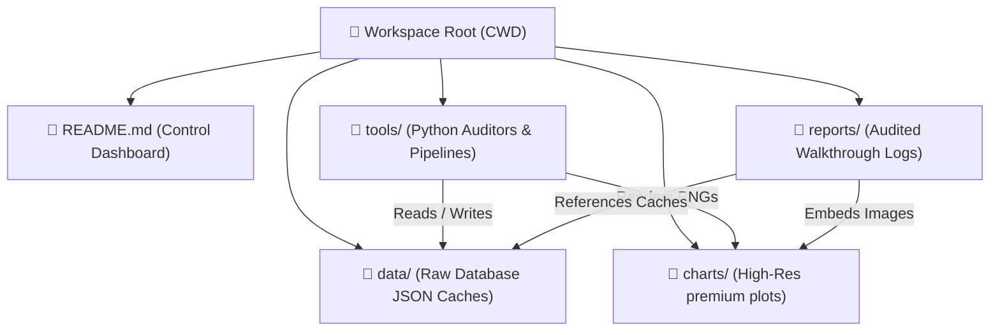

# 📊 Flutter Web Performance & Architecture Archaeology

Welcome to the **LUCI Performance Analytics & Auditing Control Center**. 

This continuous integration research package reverse-engineers the asynchronous progress-polling APIs of the Skia Perf LUCI server to isolate baseline standard deviations, mathematically filter out virtual machine hypervisor noise, and causally map **verified performance speedups and compile-size regressions** over a massive timeline of **5,000 merged master commits (representing 1 full calendar year)**.

---

## 🏛️ Project Directory Blueprint

The workspace has been organized into four highly targeted, portable sub-directories to prevent root folder clutter and maximize developer ergonomics:



---

## 🎛️ Interactive Dashboard & Index

Use the clickable relative links below to jump straight to our audited markdown reports, high-resolution PNG charts, and executable Python tools inside your editor:

### 🔬 1. Visual Performance & Size Analysis Reports
These styled walkthrough reports outline detailed C++ and Dart file modifications, optimization summaries, and database tracking statistics:

*   **[reports/wasm_noise_skeptic_audit.md](reports/wasm_noise_skeptic_audit.md):** Proves that today's massive **+41.3% (+771.7 µs) regression** uniquely affecting CanvasKit is **100% GCE VM hypervisor noise**, mathematically defining the statistical limits ($Z = 1.13\sigma$) of single-commit continuous integration runs.
*   **[reports/web_wasm_audited_ledger.md](reports/web_wasm_audited_ledger.md):** The audited wins and losses ledger for card list drawing durations. Maps Harry Terkelsen's canvas layer unification speedup, SkWasm stack-to-heap dynamic buffer migrations, and core spelling/accessibility regressions (PR #183177 / PR #186228 / PR #186591).
*   **[reports/web_wasm_text_scroll_ledger.md](reports/web_wasm_text_scroll_ledger.md):** Performance wins and losses focused on lazy text paragraph scroll frame draw baselines. Documents the historic **49.1% compiler speedup** in September 2025 (Dart SDK roll) and SkWasm C++ `DisplayList` porting!
*   **[reports/web_wasm_compile_size_ledger.md](reports/web_wasm_compile_size_ledger.md):** Size-bloat baseline plateau ledger evaluating compiled Wasm Web Build Directory bytes. Sweeps perfect flat plateau steps (Standard Deviation = 0) to verify initial Web Impeller engine bundling (+1.57 MB bloat!), fallback Roboto font packing (+88 KB), and browser decoders stripping (-300 KB drop!).
*   **[reports/web_wasm_metrics.md](reports/web_wasm_metrics.md):** The head-to-head renderer comparison study proving SkWasm MT is **62% faster** than standard CanvasKit!
*   **[reports/web_wasm_trends.md](reports/web_wasm_trends.md):** Long-term baseline moving averages curves analysis over 250 commits.
*   **[reports/perf_api_exploration.md](reports/perf_api_exploration.md):** Reverse-engineering guide mapping Skia Perf's progressive status-polling database routines.

---

### 📊 2. High-Resolution Visualizer Charts
These premium, dark-mode visualization dashboards superimpose bold rolling moving averages over raw high-frequency noise clouds to verify baseline progressions:

*   **[charts/web_wasm_compile_size_trends.png](charts/web_wasm_compile_size_trends.png):** Visualizes perfect, flat compile-size baseline steps (Hello World vs. Material vs. Gallery app sizes) showing Wasm codec stripping drops and Web Impeller jumps.
*   **[charts/web_wasm_text_scroll_trends.png](charts/web_wasm_text_scroll_trends.png):** Visualizes the 15-commit rolling Simple Moving Averages (SMA) over raw microsecond-level noise backdrops for lazy text scrolls.
*   **[charts/web_wasm_trends_chart.png](charts/web_wasm_trends_chart.png):** Visualizes long-term 250-commit baseline trends showing CanvasKit and SkWasm MT/ST.
*   **[charts/web_wasm_comparison_chart.png](charts/web_wasm_comparison_chart.png):** Head-to-head microsecond frame draw duration scatter-comparisons.
*   **[charts/complex_layout_scroll_perf_chart.png](charts/complex_layout_scroll_perf_chart.png):** Frame build times split across Pixel 7 Pro hardware and headless emulator.

---

### ⚙️ 3. Automated Performance Auditing & Tracking Tools
These executable, authenticated Python scripts run database queries and interface with the GitHub REST API using your CLI developer credentials to parse modified file paths and trace software baseline causation:

*   **[tools/audit_compile_size.py](tools/audit_compile_size.py):** Sweeps Wasm compiled directory compressed bytes, maps steps exceeding a 0.5% size threshold, audits files changed under GitHub API, and renders the baseline plateau visualization.
*   **[tools/audit_text_scroll.py](tools/audit_text_scroll.py):** Sweeps lazy text scroll frame draw durations, filters out hypervisor noise, resolves PR details, and renders the 15-commit SMA visualizer curves.
*   **[tools/audit_annual_ledger.py](tools/audit_annual_ledger.py):** Audits rich list draw durations, maps Z-Score steps exceeding a 8.5% threshold, and auto-resolves batched rolls context.
*   **[tools/fetch_wasm_trends.py](tools/fetch_wasm_trends.py):** Fetches, aligns, and plots 250 commits moving averages.
*   **[tools/fetch_web_wasm_comparison.py](tools/fetch_web_wasm_comparison.py):** Progressively queries, aligns, and plots head-to-head comparison targets.
*   **[tools/visualize_perf_data.py](tools/visualize_perf_data.py):** Progressively polls and renders single-series frame times.
*   **[tools/fetch_perf_data.py](tools/fetch_perf_data.py):** Asynchronous progress-polling dataset downloader.
*   **[tools/query_count.py](tools/query_count.py):** Pre-flights search strings to return target trace match counts.

---

### 🗄️ 4. Raw JSON Database Caches
These raw, microsecond-level and byte-level dictionary caches are mapped linearly by commit offsets, enabling local query analysis bypasses:

*   **[data/web_wasm_compile_size_dataset.json](data/web_wasm_compile_size_dataset.json):** 1-year timeline (5,000 commits) for compiled Web build directory bytecounts (Footprint: 1.1 MB).
*   **[data/web_wasm_text_scroll_dataset.json](data/web_wasm_text_scroll_dataset.json):** 1-year timeline (5,000 commits) for lazy text scroll durations (Footprint: 1.1 MB).
*   **[data/web_wasm_annual_dataset.json](data/web_wasm_annual_dataset.json):** 1-year timeline (5,000 commits) for card scroll draw durations (Footprint: 1.1 MB).
*   **[data/web_wasm_trends_dataset.json](data/web_wasm_trends_dataset.json):** 250 commits baseline trend segment dataset.
*   **[data/web_wasm_comparison.json](data/web_wasm_comparison.json):** Aligned 50 commits comparison data matrix.
*   **[data/perf_results.json](data/perf_results.json):** Initial 50 commits basic scroll draw times cache.
*   **[data/initpage.json](data/initpage.json):** Raw server parameters and trace registry configurations.
*   **[data/Perf+Query.ipynb](data/Perf+Query.ipynb):** Original Jupyter Notebook prober workspace.

---

## 💻 Quickstart Reference Console

Execute the automated file-auditing wins/losses scanners or data-science pipelines directly from the workspace root CWD using the sandboxed Python virtual environment:

### A. Execute the Compile-Size Sweep (Deterministic Size-Bloat)
```bash
./venv/bin/python3 tools/audit_compile_size.py
```
*(Sweeps compiled Wasm build directory bytecounts to audit binary-size drops and bloats.)*

### B. Execute the Text Scroll Audit (Frame Durations)
```bash
./venv/bin/python3 tools/audit_text_scroll.py
```
*(Sweeps text scrolling performance and maps DisplayList portings and Dart SDK compiler revolutions.)*

### C. Execute the flagships Card List Audit
```bash
./venv/bin/python3 tools/audit_annual_ledger.py
```
*(Chronologically scans card scroll frame times to locate direct WebUI layout wins and regressions.)*

### D. Re-compile baseline trend curves
```bash
./venv/bin/python3 tools/fetch_wasm_trends.py
```
*(Plots bold rolling Simple Moving Averages over raw noise segments for standard and WASM targets.)*
