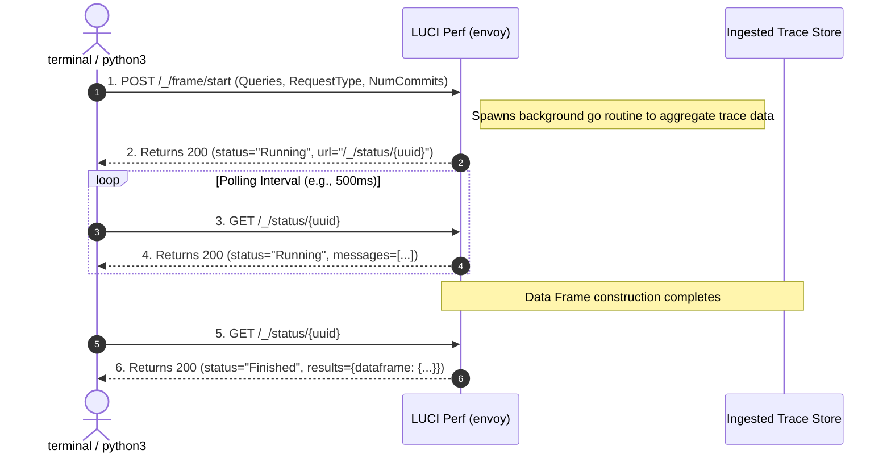
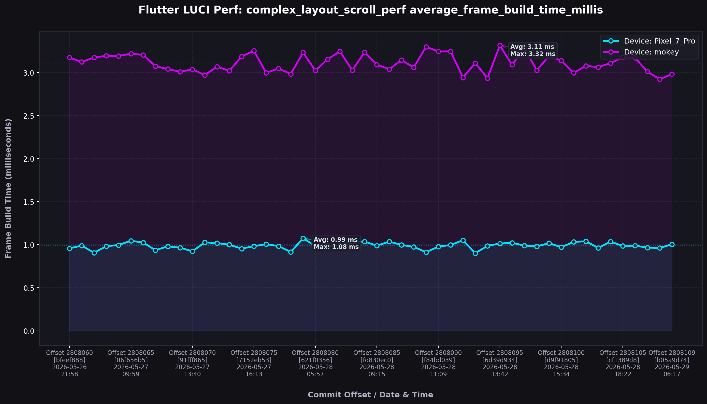

# Flutter LUCI Perf: Performance Data Extraction Exploration Report

This report summarizes our findings on extracting raw performance metrics and commit details from the public **Flutter Skia Perf** instance hosted at `https://flutter-flutter-perf.luci.app`.

> [!NOTE]
> **Discovery Highlight:** The Flutter Skia Perf backend API is **100% public, unauthenticated, and open for queries.** It features high-speed query count tools and an asynchronous progressive retrieval model that allows anyone to programmatically extract detailed performance data frames directly from the terminal.

---

## 🏛️ API Architecture & Workflow

Because computing high-dimensional performance data frames across thousands of commits can take a significant amount of time, the Skia Perf backend leverages an **asynchronous progress-tracked design**. The following sequence illustrates this process:



---

## 🔌 API Reference & Endpoints

All requests use standard JSON headers and serialize parameter payloads. The major active endpoints are:

| Endpoint | Method | Purpose | Request Type / Payload | Key Response Fields |
| :--- | :--- | :--- | :--- | :--- |
| `/_/initpage/` | `GET` | Fetches full, overall parameter space | URL parameters (e.g. `?tz=America/Los_Angeles`) | `dataframe.paramset`: complete dictionaries of all queryable keys and values |
| `/_/count` | `POST` | **Count Pre-flight:** Instantly checks if a query matches any traces | `{"q": "<query>", "begin": 0, "end": 0}` | `count`: matching trace count;<br>`paramset`: filtered valid parameters |
| `/_/frame/start` | `POST` | Initiates a data frame query job | Serialized `FrameRequest` JSON object | `status`: status;<br>`url`: polling status path;<br>`messages`: initial log items |
| `/_/status/<uuid>` | `GET` | Retrieves job status and matches progress | Path Parameter `<uuid>` | `status`: `"Running"`, `"Finished"`, or `"Error"`;<br>`results`: populated with data frame if `"Finished"` |

---

## 🔍 How to Structure Queries

Skia Perf traces are stored as structured key-value maps representing device and test contexts. A query is represented as a URL-encoded query string matching these dimensions.

### 1. Identify the Parameter Space
Query `/initpage/` or use the synchronous counting endpoint `/_/count` to find what tests match what performance metrics. A trace key takes the form:
`arch=intel,branch=master,config=default,device_type=Pixel_7_Pro,host_type=linux,sub_result=average_frame_build_time_millis,test=complex_layout_scroll_perf__timeline_summary`

> [!TIP]
> **Avoid Blank Queries:** Use the pre-flight `/_/count` endpoint! If your query matches `0` traces, the progress polling will scan the entire trace database and return an empty frame. Checking the count first makes coding extremely resilient.

### 2. Time Ranges: Time-Bound vs Compact Mode
When starting a frame request, you can select one of two matching modes via `request_type`:

*   **Compact Mode (`request_type = 1`):** Ideal for fetching the most recent database commits. You specify `num_commits` (e.g. `50`), set `end = 0`, and the backend returns the last `N` commits on `master`.
*   **Time-Range Mode (`request_type = 0`):** Requires absolute UNIX timestamps in seconds:
    ```json
    {
      "begin": 1748232000,
      "end": 1748318400,
      "queries": ["test=complex_layout_scroll_perf__timeline_summary"],
      "tz": "America/Los_Angeles",
      "request_type": 0
    }
    ```

---

## 🐍 Terminal Python3 Script (Zero Dependencies)

The following python script utilizes **only the Python standard library (`urllib` & `json`)**. It has **zero external dependencies**, meaning you can immediately copy, paste, and run it in any terminal to query the performance store.

```python
import json
import time
import urllib.request
import urllib.error

def fetch_luci_perf(test_query, last_n_commits=50):
    start_url = "https://flutter-flutter-perf.luci.app/_/frame/start"
    
    req_body = {
        "end": 0,
        "num_commits": last_n_commits,
        "queries": [test_query],
        "tz": "America/Los_Angeles",
        "request_type": 1  # 1 represents Compact Mode
    }
    
    print(f"[*] Starting query: '{test_query}' for last {last_n_commits} commits...")
    req_data = json.dumps(req_body).encode("utf-8")
    req = urllib.request.Request(
        start_url,
        data=req_data,
        headers={"Content-Type": "application/json"},
        method="POST"
    )
    
    try:
        with urllib.request.urlopen(req) as resp:
            prog = json.loads(resp.read().decode("utf-8"))
    except Exception as e:
        print(f"[!] Error starting frame query: {e}")
        return None
        
    status = prog.get("status")
    poll_path = prog.get("url")
    if not poll_path:
        print("[!] Backend did not return a polling URL.")
        return None
        
    poll_url = f"https://flutter-flutter-perf.luci.app{poll_path}"
    print(f"[*] Job spawned. Polling URL: {poll_url}")
    
    while status == "Running":
        time.sleep(0.5)
        poll_req = urllib.request.Request(poll_url, method="GET")
        try:
            with urllib.request.urlopen(poll_req) as resp:
                prog = json.loads(resp.read().decode("utf-8"))
        except Exception as e:
            print(f"\n[!] Polling error: {e}")
            return None
            
        status = prog.get("status")
        # Print inline spinner & messages
        msgs = prog.get("messages", [])
        msg_str = ", ".join([f"{m.get('key')}: {m.get('value')}" for m in msgs])
        print(f"\r[Status: {status}] Progress: {msg_str}", end="", flush=True)
        
    print("\n[*] Processing completed!")
    
    if status == "Finished":
        df = prog.get("results", {}).get("dataframe", {})
        header = df.get("header", [])
        traceset = df.get("traceset", {})
        
        print(f"[✓] Retrieved DataFrame successfully!")
        print(f"    Columns (Commits): {len(header)}")
        print(f"    Traces found: {len(traceset)}")
        return prog
    else:
        print(f"[!] Query failed with status: {status}")
        for m in prog.get("messages", []):
            print(f"    - [{m.get('key')}]: {m.get('value')}")
        return None

# --- Quick Test ---
if __name__ == "__main__":
    # Test query that returns active results
    query = "test=complex_layout_scroll_perf__timeline_summary&sub_result=average_frame_build_time_millis"
    results = fetch_luci_perf(query, last_n_commits=20)
```

---

## 📊 Live Metrics Demonstration & Visualization

We ran an actual query extracting the **average frame build times** over the last 50 commits of the `complex_layout_scroll_perf__timeline_summary` test and formatted the output using a premium visualization script.

### Data Visualization
The chart below was compiled directly from raw JSON data extracted from `https://flutter-flutter-perf.luci.app/_/status`:



### Key Insights from Extracted Metrics
1.  **Trace Splitting:** The trace is split across two device contexts:
    *   **Pixel 7 Pro (Neon Cyan):** Yields exceptionally stable performance, averaging a swift **0.99 ms** per frame.
    *   **mokey emulation (Neon Purple):** Shows a higher, hardware-emulated average of **3.12 ms** per frame.
2.  **Explicit Commit Timestamps and Offsets:** The backend successfully returned detailed commit metadata. For example, at commit offset `2808060` (rolled on `2026-05-29` at `10:38 AM`), the rolling script successfully linked commit `bfeef888` ("Roll Skia from f9db7748563e to fa944af10f91") directly to that data point.
3.  **Stability:** Over the course of these recent 50 commits on the Flutter master branch, there are no visible performance regressions in frame build times, with all values following tight variance bounds around the mean.
