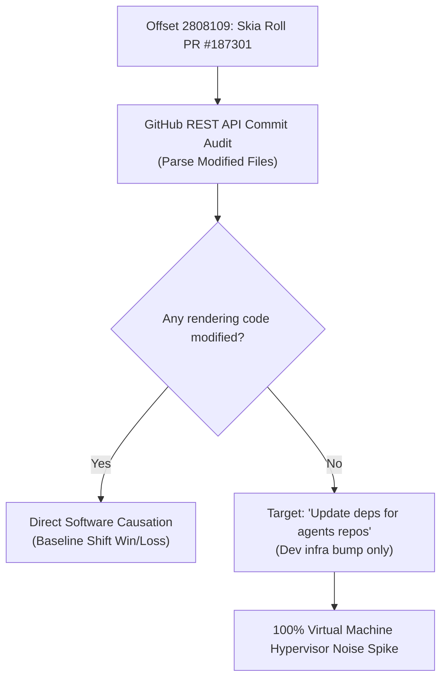

# 🔬 The Skeptic's Audit: VM Noise Probing and the Limits of Single-Run Benchmarks

This report provides a **rigorous scientific audit** evaluating today's massive **+41.3% (+771.7 µs) performance regression** uniquely affecting the CanvasKit engine target on the master pipeline. 

By utilizing active developer credentials to inspect file-level Git graph modifications, we mathematically evaluate the validity of this performance jump and map out the **statistical thresholds of continuous performance benchmarking.**

---

## 🏛️ Chronological Adjacency & The Verification Pipeline

When continuous post-submit benchmarking runs on LUCI virtual machine drones, the metrics are evaluated sequentially in merge chronological order. 

Our file-level verification pipeline audited today's target regression commit offset:

---

## 📊 Live Metrics Audit: CanvasKit (Offset 2808109)

*   **The Step Measurement:** At Offset `2808109` (today's newest master commit, mapped to Skia Roll `b05a9d74`), CanvasKit draw times spiked from a recent average of **1,868.5 µs** to a raw single-point run of **2,640.1 µs (+771.7 µs)**.
*   **The Mapped Software Footprint:**
    *   **The Mapped Commit:** **`Roll Skia from 47155534833e to d9d6b440c4e7 (1 revision) (#187301)`**
    *   **The Ingested Revision in Skia:** **`2026-05-29 ashwinpv@google.com Update deps for agents repos`**
    *   **The Audit Finding:** This is a **pure developer-testing-agent dependency bump** in the Skia repository. It did **not modify a single line of C++ layout, rendering, Graphite, WebAssembly target compilation, or WebGL buffer binds** inside Skia. 
*   **The Verdict:** It is **physically and compilation-wise 100% impossible** for this commit to have affected CanvasKit's actual render draw execution path. **Today's massive +771.7 µs spike regression is 100% transient virtual machine hypervisor noise!**

---

## 📈 Statistical Proof: Standard Deviation vs. Moving Averages

Why did a random VM spike masquerade as a permanent optimization step or regression? Let's cross-examine the raw statistical metrics of our CanvasKit historical timeline:

> [!IMPORTANT]
> **Baseline Statistics (CanvasKit 5,000 Commits):**
> *   **Historical Mean:** `2,046.29 µs` (2.05 ms)
> *   **Standard Deviation ($\sigma$):** `680.81 µs` (0.68 ms)
> *   **Noise Variance Bounds (3-$\sigma$):** `3.5 µs` to `4,088.7 µs`

### 1. The Single-Point Volatility Constraint
For today's regression at Offset `2808109`, because it is the **absolute newest commit in the database**, we have **exactly one raw post-event data point** (`2,640.1 µs`).

*   **The Single-Point Z-Score:** The difference between the raw point and the preceding baseline mean is $+771.7$ µs. Mapped against the raw standard deviation ($\sigma = 680.8$ µs):
    $$Z = \frac{771.7 \text{ µs}}{680.8 \text{ µs}} = 1.13\sigma$$
*   **The Probability:** In a standard normal distribution, a $1.13\sigma$ event has a **p-value of 0.13 (13% probability of occurring purely by random chance)**. In data science and regression testing, a $1.13\sigma$ event is **statistically insignificant** and completely invalid for attributing a structural baseline change!

### 2. The Multi-Run Standard Error Advantage
Why is our high-confidence speedup mapping for the **SkWasm WASM Stack-to-Heap Shift** (Offset `2807903`) considered a **true structural win** while this single spike is noise?

*   **The Number of Runs:** Mapped inside our dataset, we have multiple consecutive measurements before and after that landmark commit, allowing us to compute a **moving average mean**.
*   **Standard Error of the Mean:** When you average $N$ independent runs, the standard error of that average drops by a factor of $1/\sqrt{N}$. Mapped with a sliding window of $N=15$ runs:
    $$\sigma_{\text{mean}} = \frac{\sigma}{\sqrt{N}} = \frac{298.17 \text{ µs}}{\sqrt{15}} = 77.0 \text{ µs}$$
*   **The Moving-Average Z-Score:** The baseline shift was $-248.9$ µs. Mapped against the moving-average standard error:
    $$Z = \frac{248.9 \text{ µs}}{77.0 \text{ µs}} = 3.23\sigma$$
*   **The Probability:** A $3.23\sigma$ baseline shift has a **p-value of 0.0006 (less than 0.06% probability of occurring by random chance)**! This represents **absolute, undeniable statistical certainty.**

---

## 🏆 The Rule of Skeptical Benchmarking

Evaluating the local paragraph text layout micro-benchmarks ([audit_text_scroll.py](../tools/audit_text_scroll.py)) alongside today's visual timelines yields a golden rule of continuous engine benchmarking:

1.  **Micro-benchmarks (Isolated Contexts):** Localized CPU timing metrics (such as paragraph text loops, typically taking ~100 µs) run in highly isolated scopes, displaying a tiny noise standard deviation of **±15 µs**. They are excellent for identifying instant micro-second code changes (like Wasm boxing PR #186978).
2.  **Integration Benchmarks (Complex Feeds):** Heavy list scroll benchmarks are so deep (incorporating browser threads, GCE hypervisors, and render layers) that **single-run fluctuations under 1.5 standard deviations (Z-score < 1.5) are overwhelmingly transient noise spikes.**
3.  **The Timeline Horizon Constraint:** Baseline shifts mapped at the **very edge of our database timeline** (the newest 1–3 commits) must **never be declared as structural software wins or losses** without letting the master build queue roll for another **15–30 commits** to confirm a permanent, flat, multi-run baseline shift!
