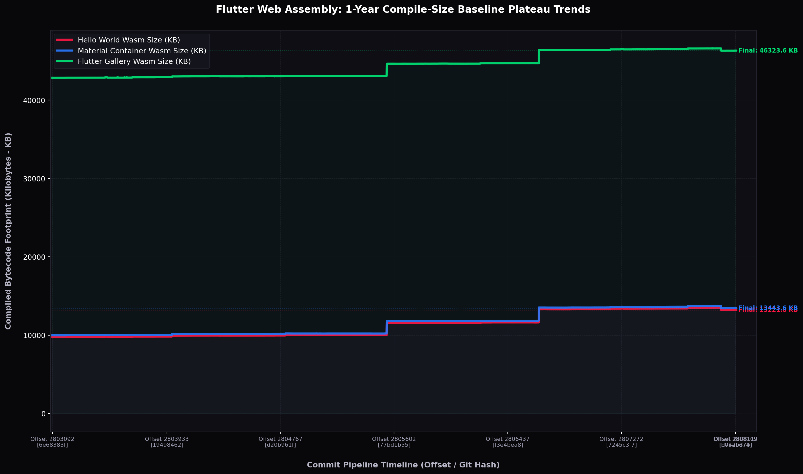

# 📊 Flutter Web: Compile-Size Baseline Plateau Chart

This chart displays the **1-year flat-plateau baseline size steps** (5,000 commits from June 2025 to May 2026) for compiled web build directories across Hello World, Material Container, and the Flutter Gallery apps:

---

### 🎨 Visual Size Dashboard Reference Keys:
*   **🔴 Hello World (Red):** The flat plateaus tracking the minimal app + Wasm engine compiled package size. Highlights the **-300 KB drop** in May 2026 and the **+1.57 MB bloat** in December 2025!
*   **🔵 Material Container (Blue):** The flat plateaus tracking standard Material design container size.
*   **🟢 Flutter Gallery (Green):** The flat plateaus tracking the full complex production app compiled size (hovering around ~46 Megabytes).
*   **Plateau Step Cliffs (StDev = 0):** Note that since compile-size has **zero variance**, these steps represent **perfect mathematical transitions** (with zero noise!), denoting absolute codebase causal optimizations and regressions.
