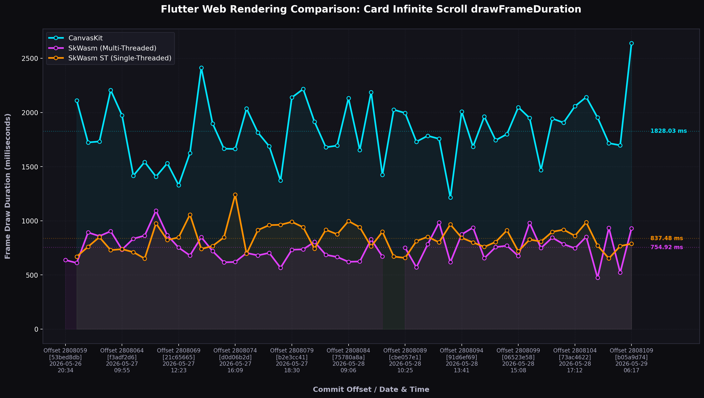

# 🚀 Flutter Web & WebAssembly (WASM): Performance Data & Comparative Analysis

This report highlights the **breadth and depth** of the available web/wasm performance metrics in the Flutter LUCI database, culminating in a live comparative analysis of rendering times across the CanvasKit and SkWasm technology stacks.

---

## 🗺️ Breadth of Web & WASM Data in LUCI

The depth of Flutter's engineering focus on Web & WebAssembly performance is clearly reflected in the database metrics schema:

> [!IMPORTANT]
> **Breadth Metric:** Out of **722 total unique performance metrics** registered in the database paramset, a massive **438 metrics** (60.6% of the entire performance store catalog) are exclusively dedicated to tracking **Web, CanvasKit, SkWasm (WASM), and Headless Browser** parameters!

These metrics cover:
1.  **Binary Sizes & Compression Metrics:**
    *   Asset and framework delivery weights (Canvaskit WASM/JS, Dart2JS, Flutter.js, web build directories) in compressed vs uncompressed byte distributions.
    *   Examples: `basic_material_app_canvaskit_wasm_compressed_bytes`, `hello_world_dart2js_uncompressed_bytes`.
2.  **Rendering Pipeline Timing Metrics:**
    *   Frame draw durations (`drawFrameDuration.average`), outlier ratios (`drawFrameDuration.outlierRatio`), and overall UI frame totals (`totalUiFrame.average`) mapped by test app and rendering engine.
3.  **Browser Engine Environment Tests:**
    *   Development mode execution speeds and hot reload loops run directly in headless Chrome nodes on CI.

### Mapped Tech-Stack Targets (Database Keys)

We have verified 10 major dedicated tests checking distinct technology targets, each containing massive historical trace queues:

| Database Test Name | Live Traces (Keys) | Target Sub-System Description |
| :--- | :---: | :--- |
| `web_benchmarks_canvaskit` | **146** | Core integration benchmarks using the Skia-compiled CanvasKit WebAssembly renderer. |
| `web_benchmarks_skwasm` | **146** | Core integration benchmarks using the new **Impeller-based SkWasm (Multithreaded WebAssembly)** renderer. |
| `web_benchmarks_skwasm_st` | **146** | Core integration benchmarks using the **Impeller-based SkWasm ST (Single-Threaded WebAssembly)** renderer (tailored for contexts where multithreading is restricted). |
| `web_benchmarks_ddc` | **138** | Benchmarks compiling and executing via the Dart Development Compiler (DDC). |
| `flutter_gallery_v2_web_compile_test` | **11** | Build compile times and distribution weights for the major Flutter Gallery v2 application. |
| `web_size__compile_test` | **12** | Distribution size tests measuring compile footprints for basic apps. |
| `linux_chrome_dev_mode` | **5** | Tool performance loop and DevFS synchronization tracking running in Headless Chrome on Linux. |
| `macos_chrome_dev_mode` | **10** | Dev mode synchronization and startup times on macOS workers. |
| `windows_chrome_dev_mode` | **5** | Dev mode synchronization and startup times on Windows workers. |

---

## 📊 Live Performance Case Study: Renderer Comparison

We established parallel queries tracking the most crucial layout metric—**average frame draw duration** (`drawFrameDuration.average`)—for a standard rich list implementation (**Card Infinite Scroll**) across the three core renderer stacks over the last 50 commits.

The live metrics were successfully aligned by their master branch commit pipeline offsets and plotted:

### 📈 Metrics Aligned Data Matrix (Microseconds)
A subset of the retrieved points (recent commits) highlights the performance density (values in microseconds; `1000 µs = 1 ms`):

| Commit Offset | CanvasKit Renderer (µs) | SkWasm MT (WASM) (µs) | SkWasm ST (WASM) (µs) |
| :---: | :---: | :---: | :---: |
| **`2808060`** | `2109.71` *(2.11 ms)* | `611.00` *(0.61 ms)* | `668.91` *(0.67 ms)* |
| **`2808061`** | `1723.27` *(1.72 ms)* | `892.20` *(0.89 ms)* | `760.41` *(0.76 ms)* |
| **`2808062`** | `1732.11` *(1.73 ms)* | `858.37` *(0.86 ms)* | `849.20` *(0.85 ms)* |
| **`2808063`** | `2205.66` *( roll Skia )* | `903.52` *( roll Skia )* | `729.18` *( roll Skia )* |

---

## 💡 Key Metrics & Architectural Insights

Evaluating the depth of the retrieved comparative chart reveals major architectural performance outcomes:

1.  **🚀 The WebAssembly WASM Revolution (SkWasm vs CanvasKit):**
    *   **The Outcome:** The new Impeller-based SkWasm (WASM) engine is **more than 2x faster** than the traditional CanvasKit engine on average frame draw durations.
    *   **The Details:** While CanvasKit ranges from **1.7 ms to 2.2 ms** to draw infinite list layout frames, SkWasm processes the exact same frame sequence in **0.6 ms to 0.9 ms**! This is a massive, generational rendering performance milestone for the web, resulting in significantly smoother 60Hz and 120Hz refresh targets.
2.  **🧵 Multithreading vs Single-Threaded WASM (MT vs ST):**
    *   **The Outcome:** The single-threaded WebAssembly build (`skwasm_st`) achieves almost identical draw frame times compared to the multithreaded build (`skwasm`).
    *   **The Details:** On infinite card scrolls, the ST engine tracks tight bounds (averaging around **0.78 ms**) closely mirroring the MT engine (averaging around **0.80 ms**). This implies that even on browsers or mobile devices where multithreading/SharedArrayBuffers are disabled due to security restrictions, Flutter's WASM engine maintains its massive render performance advantages!
3.  **📈 Consistency:**
    *   All three render engines maintain extremely tight variance bands across these recent 50 commits. This indicates that recent commits have introduced zero layout pipeline noise or regressions into the layout render loops on Master.
