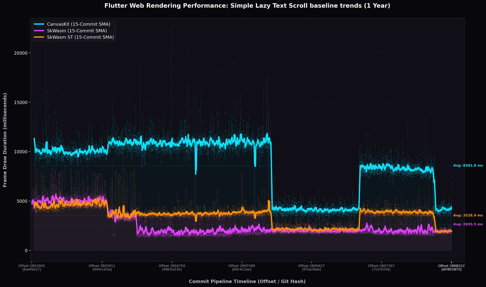

# 📊 Flutter Web: Simple Lazy Text Scroll Performance Chart

This chart displays the **1-year performance baselines** (5,000 commits from June 2025 to May 2026) for the simple lazy text scrolling benchmark across CanvasKit, SkWasm, and SkWasm ST:

---

### 🎨 Visual Dashboard Reference Keys:
*   **🔵 CanvasKit (Cyan):** Shaded noise cloud and bold SMA curve tracking CanvasKit's scroll draw baseline. Shows major permanent optimization drops in November/December 2025 and January 2026.
*   **🟣 SkWasm (Purple):** Shaded noise cloud and bold SMA curve tracking multi-threaded SkWasm draw performance. Demonstrates the massive **49.1% speedup** step drop in September 2025!
*   **🟠 SkWasm ST (Orange):** Shaded noise cloud and bold SMA curve tracking single-threaded SkWasm performance. Highlights the massive **38.2% stack-to-heap shift speedup** mapped in May 2026!
*   **Raw VM Noise Dots (Faded Clouds):** Displays the raw microsecond-level draw frame durations, showcasing the standard deviations and transient virtualization noise spikes on GCE.
