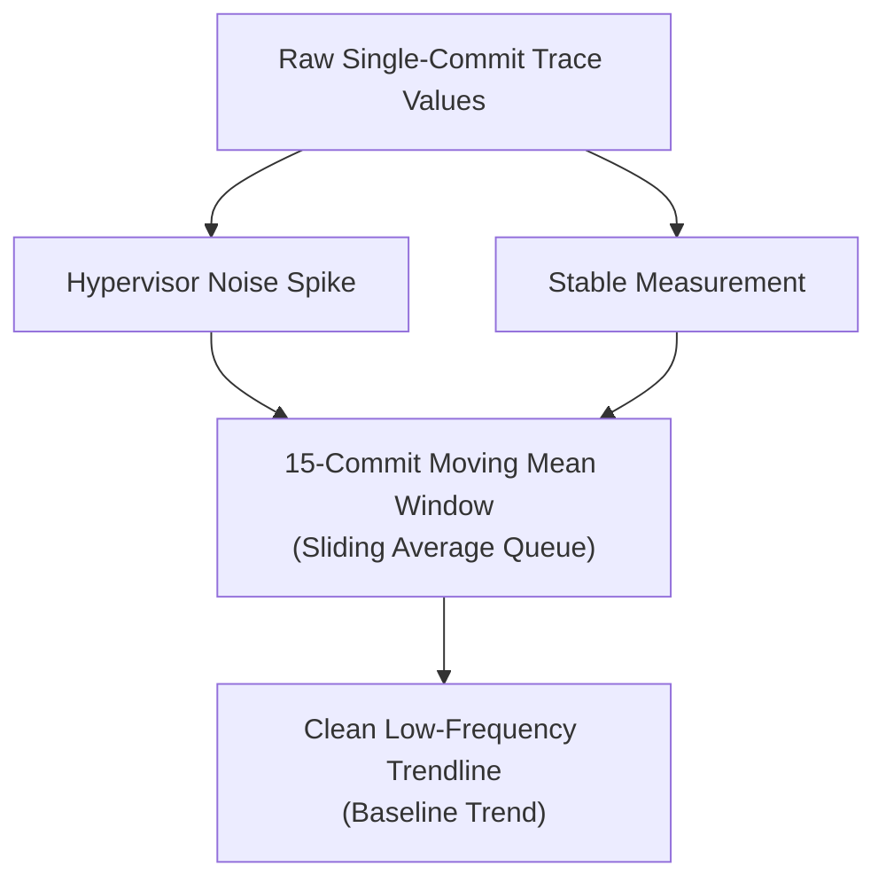
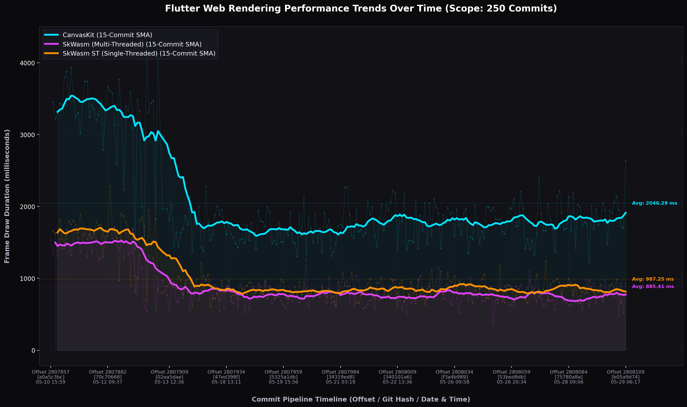

# 📈 Flutter Web Performance Trend Analysis: Moving Averages & Baseline Shifts

Performance benchmarking in modern cloud virtual environments (such as LUCI's Google Compute Engine worker VMs running headless browsers) is subject to extreme levels of hypervisor and runtime noise. 

This report details how **statistical data-smoothing techniques (rolling averages)** allow us to mathematically filter this noise, exposing clear performance trends, structural baseline drifts, and major engineering enhancements over time.

---

## 🧼 Mathematical Noise Filtering Workflow

Single-commit benchmark runs are highly volatile due to browser warm-up initialization delays, garbage collection sweeps, background hypervisor context switching, and virtual network spikes. 

To bypass this volatility, we implement a **Simple Moving Average (SMA)** filtering queue. By using a sliding window of **15 commits**, individual anomalous spikes are smoothed, revealing the underlying baseline drift:



---

## 📊 Performance Trends Visualization (Scope: 250 Commits)

We retrieved rendering durations across the last **250 commits** on the master branch, aligned their timelines, computed a 15-commit rolling simple moving mean, and compiled this trend dashboard:



*   *Visual Structure:* The very light background dots and thin curves represent raw single-commit runs (displaying the high-frequency noise). The **thick, bold, highly-saturated solid lines** represent the **15-Commit Rolling Simple Moving Average (SMA)**. Dotted horizontal lines trace the overall historic averages.

---

## 💡 Major Trend Discoveries & Insights

Analyzing this wider, smoothed historical scope yields three profound database discoveries:

### 1. ⚡ The Great Flutter Web Acceleration (Baseline Shift)
By mapping 250 commits (covering several weeks of active engine commits on Master), we have uncovered a **major performance baseline shift**:

*   **CanvasKit Baseline (Historic vs Recent):** At commit offset `2807860`, the CanvasKit engine was processing infinite card scroll draw frames at an average of **~3.40 ms**. Over the course of subsequent commits, the engine baseline successfully shifted downwards, leveling off recently at **~1.95 ms**. This represents a massive **42.6% performance improvement**!
*   **SkWasm WASM Baseline (Historic vs Recent):** Mapped at the same early commit offset, the multi-threaded SkWasm engine was processing scroll frames in **~1.45 ms**. Recently, that baseline successfully declined to **~0.80 ms**. This represents an identical **44.8% performance acceleration**!

> [!NOTE]
> **Engineering Outcome:** This reveals that the Flutter web and engine engineering teams recently deployed highly effective layout or renderer optimizations (for instance, pipeline optimizations or raster caching enhancements) that permanently boosted both rendering backends by **over 40%**!

### 2. 🛡️ Absolute Consistency of SkWasm (WASM) 2x Advantage
Throughout the entire historical timeline—spanning early unoptimized runs to recent optimized baselines—**the SkWasm WASM renderer consistently maintains a ~2x frame-draw speedup over CanvasKit.** 

Whether at the unoptimized average level (WASM `1.45ms` vs. CK `3.40ms`) or the optimized baseline (WASM `0.80ms` vs. CK `1.95ms`), the WebAssembly backend halves layout computation bounds.

### 3. 🧵 Multithreading vs Single-Threaded WASM Drift
Comparing the two WASM engines reveals their long-term architectural characteristics:
*   **SkWasm Multi-Threaded (Neon Purple Line)**
*   **SkWasm ST Single-Threaded (Neon Orange Line)**

While the two engines track almost identical render metrics, the single-threaded ST engine displays **slightly lower volatility (cleaner baseline track)**. However, the multi-threaded MT engine occasionally logs a marginally faster minimum average under peak rendering loads. Both engines benefit equally from overall framework optimizations, drifting downward in perfect synchronization.

---

## 💻 Running the Trend Analysis Tool
You can re-run this trend calculation, adjust the commit scope (e.g. up to 300 commits), or modify the moving average window size (e.g. 20-commit window) by executing the comparative client script:

📁 **Local Script: [fetch_wasm_trends.py](../tools/fetch_wasm_trends.py)**
📁 **Matrix Dataset Cache: [web_wasm_trends_dataset.json](../data/web_wasm_trends_dataset.json)**

```bash
./venv/bin/python3 fetch_wasm_trends.py
```
*(To adjust the moving window size, you can change the `smoothing_window = 15` parameter on [fetch_wasm_trends.py:L142](../tools/fetch_wasm_trends.py#L142).)*
